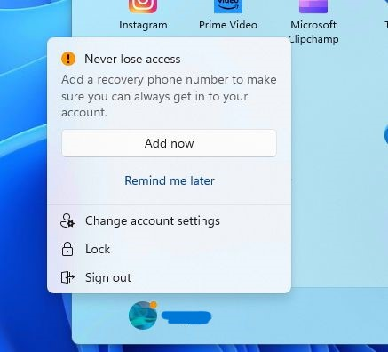

# Bad Windows, bad!
Collection of fixes for things I find annoying about Windows 11

 

## Start menu microsoft account nagging

To disable this, in group policy editor (gpedit), navigate to:

    User Configuration > Administrative Templates > Windows Components > Account Notifications

then enable the setting:

    Turn off account notifications in start

 

## Start menu web search
To disable this, in group policy editor (gpedit), navigate to:

    Computer Configuration > Administrative Templates > Windows Components > Search

then enable the settings:

    Do not allow web search

and:

    Don't search the web or display web results in Search

 

## Context menu - show more options
To get the old flat context menu, run this registry file:

[./files/classic_context_menu.reg](./files/classic_context_menu.reg)

 

## Recall AI (future)
This is the AI enhanced automated big brother constantly looking over your shoulder.
To disable this, in group policy editor (gpedit), navigate to:

    Computer Configuration > Administrative Templates > Windows Components > Windows AI

then enable the setting:

    Turn off saving snapshots for Windows
    
  
